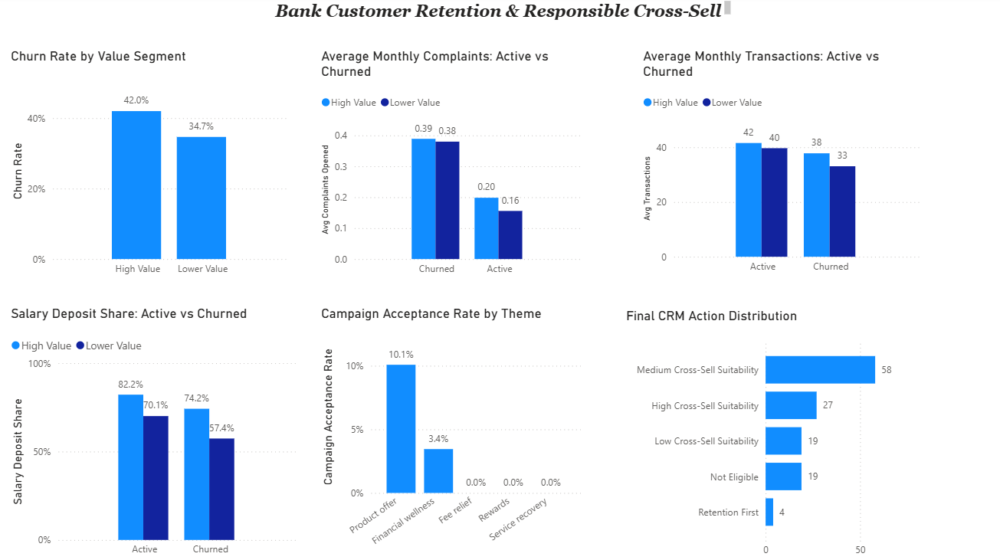

# Bank Customer Retention & Responsible Cross-Sell Analysis

An end-to-end customer analytics project focused on helping a CRM & Marketing Manager prioritize customer retention and identify responsible cross-sell opportunities.

The analysis combines customer value, churn status, monthly engagement, service experience, product usage, relationship-depth indicators, and historical campaign performance to produce explainable CRM actions.

## Dataset

This project uses a **synthetic banking dataset**, meaning that the records do **not belong to real bank customers and contain no real customer information**.

The dataset was designed to represent **realistic banking behavior, customer relationships, service interactions, engagement patterns, churn scenarios, and marketing activity**, allowing the project to demonstrate a practical end-to-end analytics workflow without relying on confidential banking data.

The term *synthetic* describes the nature of the records only. **No claim is made here about the specific method or technology used to create the dataset.**

For this reason, the project should be viewed as a demonstration of **data cleaning, analytical reasoning, customer segmentation, CRM decision-making, Power BI modeling, and business recommendation skills**, rather than as an analysis of an actual bank's customer population.

## Business Problem

The stakeholder for this project is a **CRM & Marketing Manager** who needs to balance two priorities:

1. **Retention** — identify customers who should receive greater retention attention, particularly high-value customers showing signs of potential churn.
2. **Responsible cross-sell** — identify customers who may be suitable for additional product offers without targeting customers who are dissatisfied, high-risk, or lacking marketing consent.

The analysis therefore focuses on more than simply predicting or describing churn. It combines **customer value, churn status, monthly engagement, service experience, product usage, salary deposit behavior, and historical campaign response** to support practical CRM decisions.

### Business Objectives

* Identify customer segments that should be prioritized for retention.
* Examine service and engagement patterns associated with churn.
* Assess the depth of the customer-bank relationship using available behavioral indicators.
* Evaluate historical campaign performance and identify stronger marketing themes.
* Identify responsible cross-sell opportunities among suitable Active customers.
* Ensure retention needs and marketing consent take priority over sales opportunities.

### Core Business Question

> How can the bank use customer value, engagement, service experience, relationship depth, and campaign history to prioritize retention while identifying responsible cross-sell opportunities?

## Data Structure & Scope

The analysis uses three related datasets connected through `customer_id`:

### 1. Customers

One row per customer, containing customer profile, relationship, product ownership, value, consent, and churn information.

### 2. Monthly Activity

One row per customer per month, with up to 12 months of behavioral and service activity. This dataset supports the analysis of:

* Transaction activity
* Card usage
* Product usage
* Complaints
* Service experience
* Salary deposit behavior
* Monthly engagement patterns

### 3. Campaign History

One row per campaign contact. This dataset is used to evaluate:

* Campaign themes
* Customer responses
* Offer acceptance
* Marketing consent
* Campaign eligibility and quality issues

### Data Model

The three datasets are linked through the common key:

`customer_id`

The customer table acts as the central customer-level table, while monthly activity and campaign history contain multiple records per customer.

## Data Cleaning & Quality Audit

Before analysis, the three datasets were reviewed for duplicates, missing values, logical inconsistencies, and records that could distort business conclusions.

### Customers

* Resolved one conflicting duplicate customer record while preserving the most reliable information.
* Kept missing estimated monthly income values as missing rather than creating artificial replacements.
* Flagged two customers with product-count inconsistencies for verification instead of guessing the correct value.
* Checked churn status, churn date, and churn reason for logical consistency.

### Monthly Activity

* Removed exact duplicate customer-month records.
* Retained post-churn activity records but flagged them so they could be excluded only when analytically appropriate.
* Preserved missing service ratings rather than replacing them with artificial values.
* Flagged a missing resolution-time value associated with a resolved complaint.
* Verified that card transaction counts did not exceed total transaction counts.

### Campaign History

* Flagged campaign contacts made without recorded marketing consent.
* Flagged accepted offers where no campaign response was recorded.
* Flagged campaign contacts occurring after customer churn.
* Checked delivery, opening, clicking, response, and offer-acceptance fields for logical consistency.

### Cleaning Principle

The project avoids automatically deleting imperfect records or filling missing values without evidence. Where possible, questionable records are **retained and flagged**, allowing the analysis to exclude them only when the specific business question requires it.

## Analysis Approach

The analysis was structured around the decisions a CRM & Marketing Manager would need to make rather than around isolated metrics.

### 1. Customer Value Segmentation

Customers were divided into **High Value** and **Lower Value** segments using the 75th percentile of estimated customer value.

This allowed retention patterns to be examined separately for customers with greater commercial value.

### 2. Churn Signal Analysis

Active and churned customers were compared across several service and behavioral indicators, including:

* Complaint activity
* Transaction activity
* Card usage
* Product usage
* Service ratings
* Resolution time
* Salary deposit participation
* Number of products

The goal was to identify useful warning signals while avoiding conclusions that were not consistently supported by the data.

### 3. Engagement & Relationship Analysis

Monthly customer activity was used to examine whether churned customers showed weaker engagement with the bank.

Transaction activity, card usage, product usage, and salary deposit behavior were evaluated as indicators of customer engagement and relationship depth.

### 4. Campaign Performance Analysis

Campaign records with consent, post-churn, or response-quality issues were excluded from campaign performance calculations where appropriate.

Historical campaign themes were then compared using response and offer-acceptance rates.

### 5. Retention Prioritization

Active High Value customers were evaluated using a simple, explainable warning-signal framework based on:

* Higher complaint activity
* Lower transaction activity
* Lower card usage
* Lower product usage
* No salary deposit

The resulting score is used as a **prioritization tool**, not as a predicted probability of churn.

### 6. Responsible Cross-Sell Framework

Active customers were evaluated for cross-sell suitability using engagement, complaint activity, salary deposit behavior, historical campaign response, and marketing consent.

A retention override was applied so that customers showing high churn risk are prioritized for **retention before cross-sell activity**.

## Power BI Dashboard

A single-page Power BI dashboard was developed to present the main retention and cross-sell findings in a manager-friendly format.

The dashboard focuses on six decision-relevant views:

1. Churn rate by customer value segment
2. Average monthly complaints by customer status and value segment
3. Average monthly transactions by customer status and value segment
4. Salary deposit share by customer status and value segment
5. Campaign acceptance rate by theme
6. Final CRM action distribution

## Key Findings

### High Value Customers Show Higher Observed Churn

The observed churn rate was:

* **42.0%** for High Value customers
* **34.7%** for Lower Value customers

This makes retention among High Value customers commercially important, although customer value itself should not be interpreted as a cause of churn.

### Complaint Activity Is a Strong Churn Signal

Average monthly complaint activity was noticeably higher among churned customers in both value segments:

* High Value: **0.39 churned vs 0.20 active**
* Lower Value: **0.38 churned vs 0.16 active**

Complaints therefore provide a useful early-warning signal for retention monitoring.

### Churned Customers Show Lower Engagement

Average monthly transactions were lower among churned customers:

* High Value: **37.81 churned vs 41.57 active**
* Lower Value: **33.08 churned vs 39.67 active**

Card usage and product usage showed the same general direction, supporting the use of declining engagement as an additional retention signal.

### Salary Deposit Is Associated With Deeper Customer Relationships

Salary deposit participation was higher among Active customers:

* High Value: **82.2% active vs 74.2% churned**
* Lower Value: **70.1% active vs 57.4% churned**

Salary deposit behavior may therefore indicate a deeper relationship with the bank, although it should not be interpreted as proof of loyalty or as a cause of lower churn.

### Product Offers Produced the Strongest Historical Campaign Acceptance

Among clean campaign contacts for Active customers:

* **Product offer: 10.1% acceptance**
* **Financial wellness: 3.4%**
* **Rewards: 0.0%**
* **Fee relief: 0.0%**
* **Service recovery: 0.0%**

Product offers therefore provide the strongest historical starting point for future campaign testing, while past performance should not be treated as a guarantee of future results.

### CRM Actions Separate Retention From Cross-Sell

The final framework classified the **127 Active customers** into:

* **58** Medium Cross-Sell Suitability
* **27** High Cross-Sell Suitability
* **19** Low Cross-Sell Suitability
* **19** Not Eligible
* **4** Retention First

This creates a practical CRM workflow in which marketing consent and retention needs take priority over sales opportunities.

## Business Recommendations

### 1. Prioritize High-Value Customers Showing Multiple Retention Signals

High Value customers showed a higher observed churn rate than Lower Value customers.

Retention activity should therefore focus first on **Active High Value customers who also show multiple warning signals**, such as higher complaint activity, lower transactions, lower card usage, lower product usage, or no salary deposit.

Customer value alone should not determine retention action; it should be combined with behavioral and service indicators.

### 2. Use Complaint Activity as an Early-Warning Signal

Complaint activity was substantially higher among churned customers in both value segments.

CRM teams should monitor customers with elevated or repeated complaints and consider them for early retention review, particularly when complaint activity occurs alongside declining engagement.

Complaints should be treated as a **warning signal**, not as proof that complaints caused churn.

### 3. Monitor Declining Customer Engagement

Churned customers showed lower transaction activity, card usage, and product usage.

CRM monitoring should therefore consider sustained declines across multiple engagement indicators rather than relying on a single metric.

Customers showing several weakening engagement signals may benefit from proactive retention outreach.

### 4. Use Salary Deposit as a Relationship-Depth Indicator

Salary deposit participation was higher among Active customers in both value segments.

Receiving salary through the bank may indicate that the bank plays a more central role in the customer's financial activity.

Salary deposit status can therefore support CRM segmentation and relationship-depth analysis, while avoiding the unsupported assumption that salary deposits directly prevent churn or always represent customer loyalty.

### 5. Apply Responsible Cross-Sell Rules Instead of Blanket Marketing

Cross-sell activity should focus on customers who are suitable, engaged, and eligible for marketing.

**High Cross-Sell Suitability** customers should receive first priority, followed by selective testing among Medium Suitability customers.

Historical campaign results suggest that **Product offer** campaigns provide the strongest starting point for future testing.

However:

* Customers without marketing consent should remain excluded.
* Customers showing High Churn Risk should receive **Retention First** treatment before cross-sell activity.
* Historical acceptance rates should guide testing rather than be treated as guarantees of future campaign performance.

This approach allows the bank to pursue commercial opportunities while protecting customer experience and respecting retention and consent priorities.

## Limitations

This project demonstrates an analytical and CRM decision-making workflow, but the findings should be interpreted within several limitations.

* The dataset is **synthetic and does not represent an actual bank customer population**. The results demonstrate analytical methodology rather than estimates intended for direct deployment in a real bank.
* The analysis identifies **associations and warning signals**, not causal relationships. For example, higher complaint activity or lower engagement may be associated with churn but cannot be claimed to cause it.
* The churn-risk framework is a simple, explainable **signal-counting prioritization method**, not a statistical or machine-learning probability model.
* Some records contain missing or flagged data-quality issues. These were preserved or excluded selectively rather than corrected through unsupported assumptions.
* Campaign acceptance results are based on historical observations within this dataset. Stronger historical performance for a campaign theme does not guarantee the same result in future campaigns.
* Customer segmentation thresholds and CRM rules were designed for this project and would require validation and calibration before use in a real banking environment.

In a real deployment, these findings should be validated using larger real-world datasets, additional customer-history periods, controlled campaign testing, and ongoing monitoring of model or rule performance.

## Tools & Skills

### Microsoft Excel

Used for:

* Data cleaning and quality auditing
* Customer value segmentation
* Exploratory analysis
* Retention and cross-sell scoring logic
* Validation of analytical results

### Power Query

Used to:

* Prepare cleaned datasets for the Power BI model
* Review and correct data types
* Remove non-data rows and unnecessary helper columns
* Preserve relevant data-quality flags

### Power BI

Used for:

* Relational data modeling
* DAX measures
* Metric validation
* Interactive business visualization
* Development of the final single-page CRM dashboard

### Analytical Skills Demonstrated

* Data quality assessment
* Customer segmentation
* Churn analysis
* Behavioral and engagement analysis
* Campaign performance analysis
* CRM prioritization
* Responsible cross-sell logic
* Business recommendation development
* Data storytelling

## What I Would Do Next

If this analysis were extended beyond the current portfolio scope, the next steps would be:

- Validate the retention and cross-sell rules using a larger real-world banking dataset and a longer customer history.
- Track customer behavior over time to test whether changes in complaints and engagement provide useful early warning before churn.
- Evaluate campaign themes through controlled testing rather than relying only on historical acceptance rates.
- Recalibrate customer-value and CRM-prioritization thresholds as new data becomes available.
- Develop and compare a statistical or machine-learning churn model while keeping the current explainable rule-based framework as a business benchmark.
- Reproduce selected analyses in SQL and Python to improve reproducibility and demonstrate a broader analytics workflow.
- Monitor retention and cross-sell outcomes after CRM actions to measure actual business impact.
